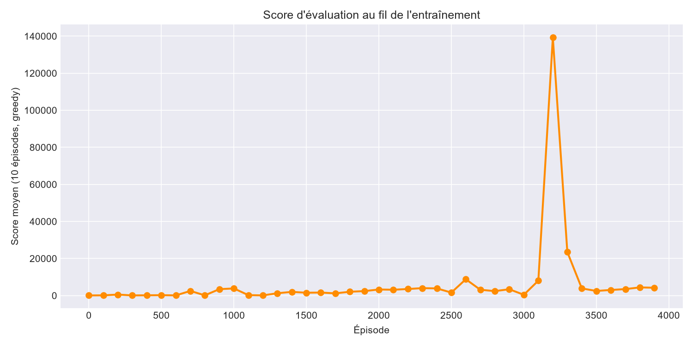
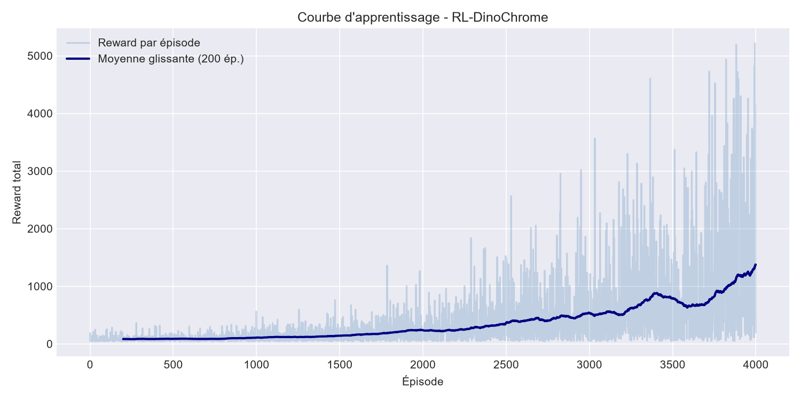
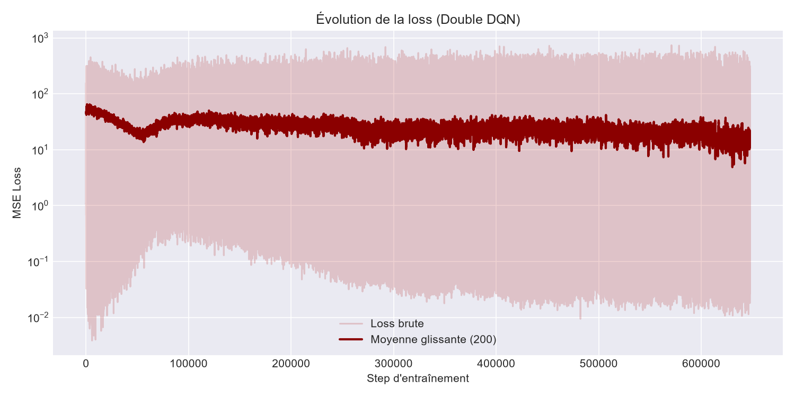
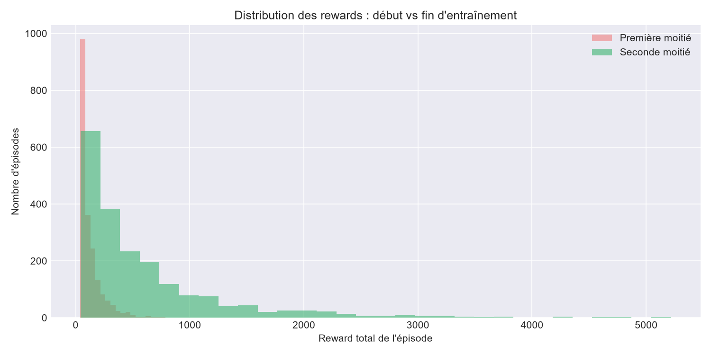

# RL-DinoChrome

Un agent de Reinforcement Learning (DQN / Double DQN) qui apprend à jouer au jeu du dinosaure de Chrome; le jeu lui-même étant entièrement recodé from scratch en Python/Pygame plutôt que réutilisé depuis une lib existante.

Ce dépôt est avant tout un terrain d'entraînement personnel pour apprendre le RL en profondeur : construire l'environnement, comprendre pourquoi un DQN "vanille" ne suffit pas, diagnostiquer des bugs subtils, et itérer méthodiquement jusqu'à obtenir un agent stable.

## Sommaire

- [Aperçu](#aperçu)
- [Le jeu (environnement)](#le-jeu-environnement)
- [L'agent (DQN / Double DQN)](#lagent-dqn--double-dqn)
- [Représentation de l'état, actions, reward](#représentation-de-létat-actions-reward)
- [Les difficultés rencontrées et comment je les ai résolues](#les-difficultés-rencontrées-et-comment-je-les-ai-résolues)
- [Résultats](#résultats)
- [Ce que j'ai appris](#ce-que-jai-appris)
- [Stack technique](#stack-technique)
- [Structure du dépôt](#structure-du-dépôt)
- [Installation et utilisation](#installation-et-utilisation)
- [Pistes que je compte explorer ensuite](#pistes-que-je-compte-explorer-ensuite)

## Aperçu

Le projet a deux briques indépendantes :

1. **Le jeu** (`dino_env/`) : un clone du Dino de Chrome fait à la main avec Pygame. Physique du saut, accroupissement, cactus de tailles variées, ptérodactyles à trois altitudes, accélération progressive de la vitesse, spawn d'obstacles piloté en frames (pas en pixels, pour que le temps de réaction du joueur ne dépende pas de la vitesse au sol).
2. **L'agent** (`agent/`) : un Double DQN classique (réseau principal + réseau cible + replay buffer) entraîné à jouer à ce jeu à partir d'un état numérique compact (pas de pixels en entrée).

Le jeu est jouable manuellement (`scripts/play_human.py`), observable en mode debug avec hitboxes (`scripts/demo.py`), et entraînable de bout en bout (`scripts/train_agent.py`).

## Le jeu (environnement)

Points de conception notables :

- **3 actions dès le départ** : ne rien faire, sauter, s'accroupir (`Action.NOTHING / JUMP / DUCK`), avec un système d'états (`State.RUNNING/JUMPING/DUCKING/FAST_FALLING/CRASHED`) qui gère notamment la chute rapide quand on appuie sur "bas" pendant un saut.
- **Cactus et ptérodactyles mélangés dès le premier épisode** (pas de progression de difficulté artificielle où les ptérodactyles n'apparaîtraient qu'après un certain score) : 65% cactus / 35% ptéro, avec 3 hauteurs de vol différentes pour les ptérodactyles (`P_LOW`, `P_MID`, `P_HIGH`), ce qui oblige l'agent à apprendre les trois réponses possibles (sauter, s'accroupir, ne rien faire) dès le début.
- **Spawner en frames, pas en pixels** : l'intervalle entre deux obstacles est un nombre de frames qui se resserre progressivement avec la vitesse (`_new_interval`), pour garder un temps de réaction cohérent quel que soit le défilement.
- **Hitboxes tolérantes** : `.inflate(-10, -10)` sur les rectangles de collision pour éviter les morts injustes sur un pixel de recouvrement.

## L'agent (DQN / Double DQN)

- Réseau : MLP `5 → 128 → 128 → 128 → 3` (ReLU).
- **Double DQN** : le réseau principal choisit la meilleure action sur le `next_state`, le réseau cible évalue cette action, ça découple sélection et évaluation et réduit la surestimation classique du DQN vanille.
- Replay buffer : `deque` de capacité 500 000, échantillonnage aléatoire uniforme.
- Entraînement toutes les 4 steps (`train_nstep`), mise à jour du réseau cible toutes les 10 000 steps (`target_update_freq`), batch de 128, Adam (lr=1e-4), gradient clipping (`max_norm=1.0`).
- `gamma = 0.99`, epsilon-greedy avec decay multiplicatif (0.999 par épisode) jusqu'à `eps_min = 0.001`.

## Représentation de l'état, actions, reward

L'état est un vecteur de 5 valeurs normalisées, calculé à chaque step (`env.get_state()`) :

| Composante | Description |
|---|---|
| `distance_norm` | distance horizontale au prochain obstacle, normalisée par la largeur d'écran |
| `width_norm` | largeur de cet obstacle |
| `height_norm` | hauteur/altitude de l'obstacle |
| `speed_norm` | vitesse actuelle du jeu |
| `velocity_norm` | vitesse verticale du dino (utile pour distinguer montée/descente de saut) |

Un principe que j'ai voulu respecter strictement : **l'état est conçu, la politique est apprise**. Je donne à l'agent une représentation numérique honnête de la situation (distance, hauteur, vitesse...), mais je ne lui dis jamais quoi faire avec aucune règle `if distance < X: jump()` codée en dur. Tout le mapping état → action vient du DQN entraîné par essai-erreur.

Reward très simple, volontairement peu façonné (`reward_count`) :
- `+1` par step survécu
- `-100` si collision
- `0` si troncature (fin d'épisode "normale", pas une mort)

## Les difficultés rencontrées et comment je les ai résolues

### Confusion `terminated` vs `truncated`

Gymnasium distingue une fin d'épisode par échec réel (`done`/`terminated`) d'une fin par troncature externe (`truncated`, ex. limite de steps). Au départ ces deux signaux étaient mélangés dans la boucle d'entraînement, ce qui posait un problème précis : le buffer de replay doit stocker uniquement `done` (pas `done or truncated`) pour que le bootstrap de Bellman soit correct, une troncature ne doit pas mettre à zéro la valeur future estimée, contrairement à une vraie mort. J'ai séparé proprement les deux signaux partout (boucle de jeu, agent, buffer), avec la condition de sortie de boucle `while not (done or truncated)` mais le masquage du Q-target basé uniquement sur `done`.

### Bug d'incrément de vitesse (jeu ~20x trop lent à accélérer)

La condition `int(score) % SCORE_PER_SPEEDUP == 0` était vraie sur plusieurs frames consécutives à chaque palier (le score étant un float qui traverse lentement chaque entier), donc l'incrément de vitesse se déclenchait des dizaines de fois au lieu d'une seule. Le jeu accélérait beaucoup trop lentement par rapport à l'intention de design. Corrigé en suivant explicitement le prochain seuil à atteindre (`next_speedup_score`) plutôt qu'un test de modulo sur une valeur flottante.

### `gamma = 0.999` → croissance non bornée des Q-values

Avec un reward de survie de +1/step et un horizon effectif très long (`gamma=0.999`), les Q-values explosaient progressivement pendant l'entraînement. L'agent "regardait" trop loin dans le futur pour une tâche dont l'horizon utile (réagir à un obstacle) est de l'ordre de la centaine de steps. Passé à `gamma = 0.99`, qui correspond à peu près à l'échelle de temps réelle d'esquive d'obstacles, la loss et les Q-values sont redevenues stables.

### Oubli catastrophique (le problème le plus difficile à diagnostiquer)

C'est le bug qui m'a le plus agacé.

**Symptôme** : l'agent découvrait parfois une bonne politique càd la courbe d'évaluation (greedy, sans exploration) montait jusqu'à des pics autour de ~275 000 de reward (fin du jeu), puis s'effondrait brutalement quelques centaines d'épisodes plus tard, sans raison apparente dans le code.

**Démarche de diagnostic** (en appliquant le principe "un seul changement à la fois", pour ne jamais mélanger les causes possibles) :
- Distinction stricte entre **reward d'entraînement** et **courbe d'évaluation**. Le reward d'entraînement est plafonné statistiquement par l'epsilon-greedy : une seule action aléatoire mal placée suffit à tuer l'agent, donc cette courbe ne mesure jamais vraiment la qualité de la politique apprise. Seule la courbe d'éval (epsilon=0, purement greedy) donne un signal fiable.
- Logging du nombre de steps par épisode en plus du reward, pour distinguer une vraie régression de politique d'un simple artefact de mesure.
- Script de test avec des épisodes aléatoires et démo visuelle avec overlay de hitboxes (`demo.py`, mode debug F1) pour vérifier que le comportement observé correspondait bien à ce que suggéraient les courbes.

**Cause racine identifiée** : le régime de haute vitesse (atteint seulement à partir d'un score ~1200+) était systématiquement absent du replay buffer. Pendant la collecte epsilon-greedy classique, l'agent meurt presque toujours avant d'atteindre ce régime, donc le buffer ne contenait quasiment aucune transition à vitesse élevée. Résultat : dès que l'agent progressait assez pour atteindre cette zone en évaluation, il s'y comportait n'importe comment, puisqu'il n'avait jamais eu de signal d'apprentissage dessus.

**Solution retenue** : un `collector_network` séparé et gelé, rechargé périodiquement depuis le meilleur checkpoint sauvegardé (`trained_model.pth`). Toutes les `collect_freq` épisodes, ce réseau joue un épisode en pur greedy (donc capable d'atteindre la haute vitesse, puisqu'il utilise la meilleure politique connue à cet instant), plafonné à `collect_step` steps pour éviter un trop long épisode, et les transitions générées sont poussées dans le buffer partagé exactement comme n'importe quelle autre expérience.

Le point important conceptuellement : la politique de comportement (comment on collecte les données) est indépendante de la mise à jour de Bellman, du réseau cible et de la logique Double DQN. Changer uniquement le collecteur ne sort pas du cadre "DQN" ça reste du off-policy learning classique, juste avec une source de données mieux distribuée sur toute la gamme de difficulté du jeu (et pas seulement les états à basse vitesse).

Une correction importante que je me suis faite à moi-même en cours de route : utiliser directement le réseau *en cours d'entraînement* pour cette collecte n'aurait rien réglé, puisque ce réseau est précisément celui qui vient de dégrader. Collecter avec un modèle déjà cassé pour "réparer" le même modèle est contre intuitif. D'où l'intérêt du réseau gelé rechargé depuis le meilleur checkpoint, découplé du réseau qui est en train d'apprendre.

## Résultats

Run de 4000 épisodes, environ 650 000 steps d'entraînement au total, évaluation (10 épisodes greedy) toutes les 100 épisodes.

### Courbe d'évaluation



Elle reste basse et plate pendant une grande partie de l'entraînement, puis un pic très net apparaît autour de l'épisode 3200, où le score moyen en évaluation grimpe à environ **140 000**. C'est exactement le genre de pic dont parle la section sur l'oubli catastrophique plus haut : l'agent découvre une politique capable de survivre très longtemps, y compris en régime de haute vitesse.

Le problème, c'est la suite : dès l'épisode suivant (~3300), le score retombe à ~23 000, puis quelques centaines d'épisodes plus tard il s'effondre complètement à un plateau de l'ordre de 3 000–4 000, où il reste jusqu'à la fin de l'entraînement (épisode 3900).

**Constat** : même avec le `collector_network` déjà en place dans cette run, le schéma classique d'oubli catastrophique s'est reproduit: un pic suivi d'un effondrement qui ne se rattrape pas avant la fin des 4000 épisodes prévus. Le mécanisme de collecte a peut-être aidé l'agent à *atteindre* ce pic à 140 000 (un score bien plus haut que tout ce qui apparaît avant), mais il n'a pas suffi à empêcher la chute une fois le pic dépassé, ni à permettre une récupération dans la fenêtre de temps observée. Le meilleur modèle reste heureusement sauvegardé (`trained_model.pth` correspond au pic, grâce à la logique de sauvegarde sur meilleur score d'éval), donc le run n'est pas "perdu" mais le problème de stabilité n'est pas résolu, seulement atténué.

### Courbe d'apprentissage (reward d'entraînement)



La moyenne glissante monte globalement sur la durée de l'entraînement, de ~100 en début de run à ~1400 vers l'épisode 4000, avec une variance énorme épisode par épisode (certains épisodes individuels dépassent 5000 de reward brut vers la fin). On voit aussi un plateau/léger creux de la moyenne glissante entre les épisodes ~3300 et ~3600 ce qui est cohérent dans le temps avec l'effondrement observé sur la courbe d'éval, même si l'effet y est beaucoup plus amorti.

### Loss (Double DQN)



La loss brute reste bruitée mais bornée sur toute la durée de l'entraînement (grossièrement entre 1e-2 et 1e3, en échelle log), et sa moyenne glissante décroît légèrement, de ~50 en début d'entraînement à ~10–20 vers la fin. Pas de divergence numérique visible : la baisse de `gamma` à 0.99 a bien réglé le problème de croissance non bornée des Q-values rencontré précédemment.

### Distribution des rewards (première vs seconde moitié)



La première moitié de l'entraînement est très concentrée près de 0 (l'immense majorité des épisodes se terminent vite, ce qui est attendu tôt dans l'apprentissage). La seconde moitié garde un pic proche de 0 mais s'étale beaucoup plus loin, avec une queue de distribution qui va jusqu'à plus de 5000 ce qui est cohérent avec une politique globalement meilleure en fin d'entraînement, même en comptant l'épisode d'effondrement.

### Bilan

Le fix du `collector_network` a permis à l'agent d'atteindre un pic de performance nettement supérieur à tout ce qui précède (140 000 contre quelques milliers), ce qui confirme que le manque de couverture du buffer sur les états à haute vitesse était bien un facteur limitant important. En revanche, cette run montre que le fix seul ne suffit pas à *stabiliser* durablement la politique une fois ce pic atteint. L'oubli catastrophique reste présent.

## Ce que j'ai appris

- **Le reward d'entraînement pas fiable.** Avec de l'epsilon-greedy, une seule action aléatoire au mauvais moment tue l'agent. La courbe de training reward est structurellement plafonnée et ne reflète pas la qualité réelle de la politique. Seule une évaluation greedy (epsilon=0) est un signal de confiance.
- **L'oubli catastrophique en DQN** à gérer (sauvegarde du meilleur checkpoint, diversité du buffer), pas un problème qu'on élimine avec un simple ajustement de update.
- **La couverture du replay buffer compte autant que sa taille.** Un buffer énorme mais qui ne contient que des états faciles ne peut pas entraîner une politique capable de gérer les états difficiles.
- **Isoler une variable à la fois** est indispensable dès que plusieurs bugs/hyperparamètres sont candidats à expliquer un symptôme sinon on ne peut jamais attribuer l'effet à la bonne cause.
- **Le transfert CPU↔GPU** pour gagner des performances ou en perdre selon la taille du reseau.

## Stack technique

- Python 3.12
- PyTorch (CUDA)
- Pygame : moteur du jeu
- Gymnasium : convention d'interface RL (`step`, `reset`, `terminated`/`truncated`)
- NumPy, Matplotlib

## Structure du dépôt

```
dino_env/       # le jeu (moteur, entités, rendu, assets, constantes)
agent/          # l'agent DQN (réseau, replay buffer, logique d'entraînement)
scripts/        # points d'entrée : jouer, entraîner, visualiser, tracer les courbes
```

## Installation et utilisation

```bash
pip install -r requirements.txt
```

- Jouer soi-même : `python scripts/play_human.py` (flèches + espace, F1 pour afficher les hitboxes)
- Entraîner l'agent : `python scripts/train_agent.py`
- Regarder l'agent entraîné jouer : `python scripts/demo.py`
- Générer les courbes après entraînement : `python scripts/plot_results.py`

---